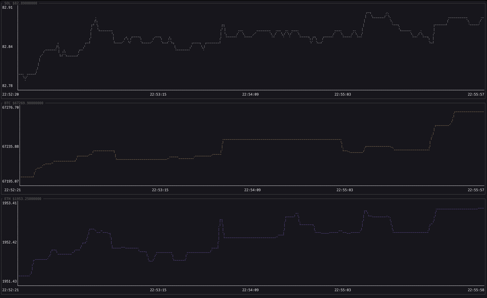

# Crypto Watcher

> **Note:** This project was created specifically to study and practice Rust programming concepts, particularly async runtime, TUI development, and clean code practices.



---

## Features

- Monitors real-time prices for any symbol on Binance
- Preloads historical candles at startup for immediate chart context
- Configurable timeframe (`--interval`) and historical depth (`--lookback`)
- Indicator overlays and oscillator panel configurable by CLI (`--indicator`)
- Renders multi-asset charts using `ratatui`
- Displays dynamically scaling Y-axes and human-readable X-axes with timestamps

---

## Requirements

- Rust (latest stable, with Edition 2024 support)
- Cargo
- Working internet connection (to reach Binance API)

---

## Installation

1. Clone the repository:
```bash
git clone https://github.com/kodezy/crypto-watcher.git
cd crypto-watcher
```

2. Build the project:
```bash
cargo build --release
```

---

## Usage

Start the application directly using Cargo:

```bash
cargo run -- [OPTIONS] [symbol1] [symbol2] ...
```

Or run the compiled binary:

```bash
./target/release/crypto-watcher [OPTIONS] [symbol1] [symbol2] ...
```

- **`--interval` / `-i`**: Candle interval (examples: `1m`, `5m`, `1h`, `1d`).
- **`--lookback` / `-l`**: Number of historical candles to preload (1 to 600).
- **`--refresh-ms` / `-r`**: Real-time polling interval in milliseconds.
- **`--indicator` / `-I`**: Indicator specs (repeatable or comma-separated).  
  Supported: `sma[:period]`, `ema[:period]`, `bb[:period[:multiplier]]`, `rsi[:period]`.
  If omitted, defaults to `EMA(20), SMA(50), RSI(14)`.

Examples:

```bash
cargo run -- --interval 5m --lookback 300 BTC ETH SOL
cargo run -- -i 1h -l 168 BTCUSDT
cargo run -- -i 15m -I ema:21 -I sma:50,bb:20:2,rsi:14 BTC ETH
```

- **Exit:** Press `q` to safely exit the application.

## UI Legend (Colors)

The app footer includes a live legend. Color mapping:

- **Price**: gold
- **SMA/EMA overlays**: blue / purple / green / red palette (depends on overlay order)
- **Bollinger Mid**: light blue
- **Bollinger Upper**: coral red
- **Bollinger Lower**: green
- **RSI**: indigo
- **RSI 70 level**: red
- **RSI 30 level**: green

---

## Architecture

- **`main.rs`**: Core application flow, CLI parsing, startup preload, async update loop, and TUI rendering.
- **`app.rs`**: Application state models (`App`, `Asset`) and in-memory history management.
- **`api.rs`**: Binance API helpers (symbol validation, spot price, and historical klines fetch).
- **Dependencies**:
  - `ratatui` & `crossterm`: Terminal UI rendering and event mapping.
  - `tokio`: Async runtime for parallel REST requests.
  - `reqwest`: HTTP client to fetch data.
  - `serde` & `serde_json`: JSON parsing.
  - `chrono`: Real-time timestamp formatting.
